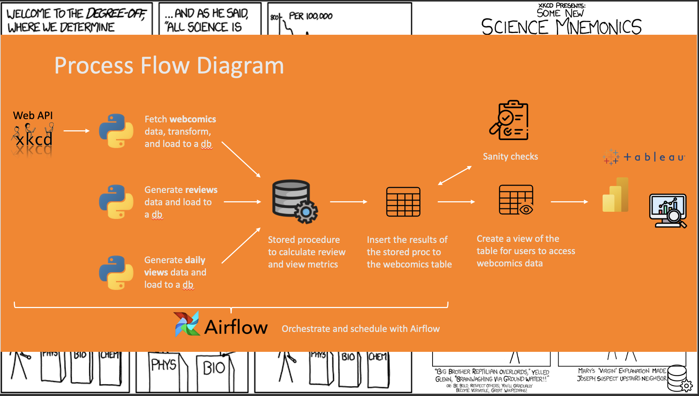

About the project 
===


Xkcd, sometimes styled XKCD is a webcomic of romance, sarcasm, math, and language created in 2005 by American author Randall Munroe. The subject matter of the comic varies from statements on life and love to mathematical, programming, and scientific in-jokes. Some strips feature simple humor or pop-culture references. New cartoons are added three times a week, on Mondays, Wednesdays, and Fridays. Use the following link to go through the API documentation.

https://xkcd.com/json.html

Project Contents
================
This project consists of:
- `scr` folder that contains:
  - Python scripts for ingesting and processing data from Xkcd, generating dummy reviews data and views data, and loading data to a database.
  - Database scripts for creating tables, views, stored procedures, functions as well as sample queries for data quality checks.
- `dags` folder which contains the code for Airflow pipelines,
- `astro` and `Dockerfile` which contain configuration for Astro CLI.

How it works
================
You can execute the process manually by running the scripts in the `scr` folder, or run it in a local Airflow environment.

To initialize the Astro environment for the first time, run the following command:
```sh
    astro dev init
```
To start Astro:
```sh
    astro dev start
```
This will allow you to run the Airflow pipeline locally.

To pause all Docker containers running your local Airflow environment, run the command:
```sh
    astro dev stop
```

What it does
================
The ETL process fetches data from Xkcd. It checks whether any new comics have been published. If so, it processes them and writes them to a database. A stored procedure is used to combine comics data with reviews and views data. Aggregated results are written to a table, which is consumed by users via a view.


